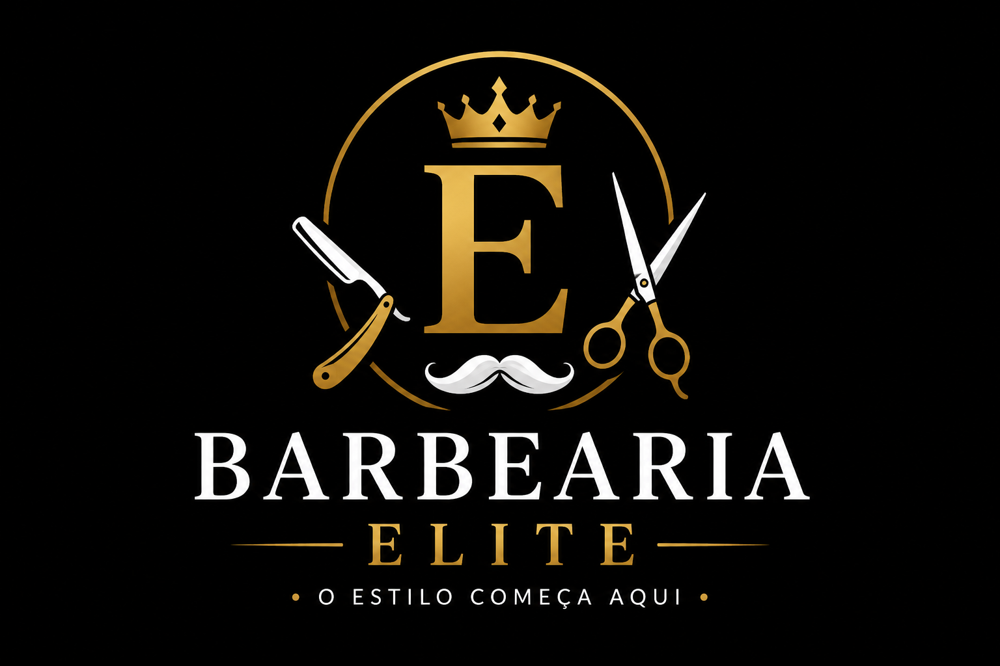

<h1 align="center">💈 Barbearia Elite</h1>

<p align="center">
  
</p>

<p align="center">
  <strong>Projeto desenvolvido como trabalho final da disciplina de Desenvolvimento Front-end.</strong>
</p>

<p align="center">
  
  
  
  
  
  
</p>

---

# 📋 Sumário

- [📖 Sobre o Projeto](#sobre-o-projeto)
- [✨ Funcionalidades](#funcionalidades)
- [📁 Estrutura do Projeto](#estrutura-do-projeto)
- [📄 Páginas](#paginas)
- [🛠 Tecnologias Utilizadas](#tecnologias-utilizadas)
- [🚀 Como Executar](#como-executar)
- [🌐 Site Publicado](#site-publicado)
- [👨‍💻 Autor](#autor)

---

<a id="sobre-o-projeto"></a>

# Sobre o Projeto

A **Barbearia Elite** é um site desenvolvido como projeto final da disciplina de **Desenvolvimento Front-end** do Instituto Federal do Piauí (IFPI).

O objetivo do projeto é apresentar uma barbearia fictícia, permitindo que o usuário conheça seus serviços, visualize imagens, conheça a equipe de barbeiros e realize um agendamento.

---

<a id="funcionalidades"></a>

# Funcionalidades

- 🏠 Página Inicial
- ✂️ Página de Serviços
- 🖼️ Galeria de Fotos
- 👨‍💼 Página da Equipe
- 📅 Página de Agendamento
- 🔗 Navegação entre todas as páginas
- 📱 Layout responsivo

---

<a id="estrutura-do-projeto"></a>

# Estrutura do Projeto

```text
Barbearia-Elite
│
├── css
│   ├── index.css
│   ├── servicos.css
│   ├── galeria.css
│   ├── equipe.css
│   └── agendamento.css
│
├── img
│   ├── banner.png
│   ├── logo.jpg
│   ├── barbeiro1.jpg
│   ├── barbeiro2.jpg
│   ├── barbeiro3.jpg
│   ├── corte1.jpg
│   ├── corte2.jpg
│   └── corte3.jpg
│
├── index.html
├── servicos.html
├── galeria.html
├── equipe.html
├── agendamento.html
│
└── README.md
```

---

<a id="paginas"></a>

# Páginas

## 🏠 Início

Apresenta a barbearia, um banner principal e informações sobre os serviços.

## ✂️ Serviços

Exibe todos os serviços oferecidos e seus respectivos valores.

## 🖼️ Galeria

Mostra imagens dos cortes de cabelo e do ambiente da barbearia.

## 👨‍💼 Equipe

Apresenta os barbeiros responsáveis pelos atendimentos.

## 📅 Agendamento

Permite ao cliente preencher um formulário para solicitar um horário.

---

<a id="tecnologias-utilizadas"></a>

# Tecnologias Utilizadas

| Tecnologia | Utilização |
|------------|------------|
| HTML5 | Estrutura das páginas |
| CSS3 | Estilização do site |
| Flexbox | Organização do cabeçalho, menu e alinhamento dos elementos |
| CSS Grid | Organização dos cards das páginas de Serviços, Galeria e Equipe |
| Git | Controle de versão |
| GitHub | Hospedagem do projeto |
| GitHub Pages | Publicação do site |

---

<a id="como-executar"></a>

# Como Executar

### Clone o repositório

```bash
git clone https://github.com/hugss08/Barbearia---Trabalho-final.git
```

### Entre na pasta

```bash
cd Barbearia---Trabalho-final
```

### Execute

Abra o arquivo **index.html** em qualquer navegador ou utilize a extensão **Live Server** no Visual Studio Code.

---

<a id="site-publicado"></a>

# Site Publicado

Acesse o projeto:

🔗 **https://hugss08.github.io/Barbearia---Trabalho-final/**

---

# Prévia

Adicione um print da página inicial na pasta **img** com o nome `preview.png`.

Depois utilize:

```html
<p align="center">
   
</p>
```

---

<a id="autor"></a>

# Autor

**Hugo Henrique**

🎓 Curso: Tecnologia em Sistemas para Internet

🏫 Instituto Federal do Piauí – IFPI

📚 Disciplina: Desenvolvimento Front-end

👨‍🏫 Professor: Alexandre Ribeiro Cajazeira Ramos

---

<p align="center">
💈 Desenvolvido por <strong>Hugo Henrique</strong> • 2026
</p>